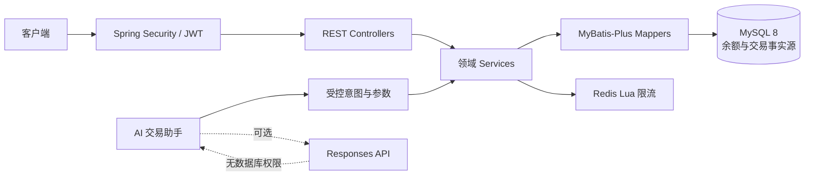
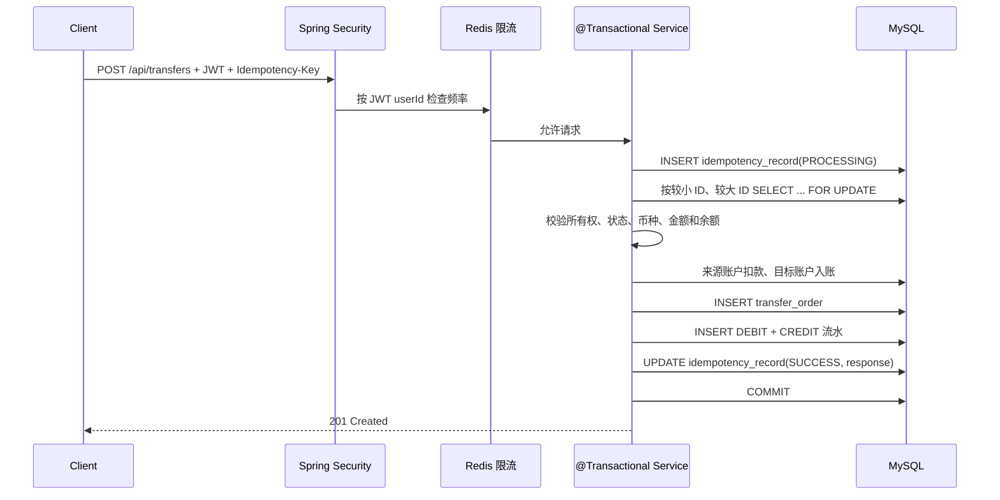

# FinLedger——智能资金账户与交易管理平台

FinLedger 是一个用于 Java 后端学习、校招面试和工程能力展示的模块化单体项目。它模拟
用户、资金账户、充值、转账和交易流水，但不连接银行、银行卡或支付渠道，也不处理真实资金。

项目重点不是页面数量，而是把一次资金变更做正确：数据库事务、并发锁、幂等、金额精度、
鉴权、审计流水、自动化测试和受控 AI 集成。

## 当前完成度

Phase 0—17 已完成，核心能力包括：

- 同源响应式 Web 工作台，覆盖注册、登录、账户、充值、转账、流水与 AI 查询；
- 用户注册、BCrypt 密码存储、登录和 HS256 JWT 鉴权；
- 模拟资金账户创建、归属校验、余额查询和模拟充值；
- `@Transactional` 原子转账、余额校验和双边交易流水；
- `SELECT ... FOR UPDATE` 悲观锁及固定账户 ID 加锁顺序；
- `Idempotency-Key`、请求摘要、MySQL 唯一约束和响应回放；
- Redis Lua 固定窗口限流，Redis 故障时不影响 MySQL 核心一致性；
- 统一业务异常、参数异常、401/403 和安全错误响应；
- JUnit 5、Mockito、Spring MVC、Testcontainers + MySQL 8 测试；
- 多阶段 Docker 镜像、非 root 运行、Compose 健康检查和 GitHub Actions；
- 只读 AI 交易分析助手，模型不能访问数据库、执行 SQL 或修改余额。

## 技术栈

| 层次 | 技术 |
| --- | --- |
| 语言与构建 | Java 17、Maven Wrapper |
| Web | Spring Boot 3.5、Spring MVC、Bean Validation |
| 数据访问 | MyBatis-Plus 3.5、MySQL 8.4、InnoDB |
| 安全 | Spring Security、OAuth2 Resource Server、JWT、BCrypt |
| 辅助组件 | Redis、Lua 限流脚本 |
| 测试 | JUnit 5、Mockito、Spring MVC Test、Testcontainers |
| 工程化 | Docker、Docker Compose、GitHub Actions |
| AI | OpenAI Responses API 适配器、严格 JSON Schema、规则模式兜底 |

## 系统架构



代码按业务模块组织，而不是把所有 Controller、Service、Mapper 分散在全局技术目录：

| 模块 | 职责 |
| --- | --- |
| `user` / `auth` / `security` | 用户、登录、JWT 身份与权限边界 |
| `account` / `recharge` | 账户状态、所有权、余额和模拟充值 |
| `transfer` | 转账编排、账户更新、订单写入 |
| `ledger` | 不可变交易流水与分页查询 |
| `idempotency` | 请求占位、唯一约束、摘要校验和响应回放 |
| `ratelimit` | 非核心 Redis 限流 |
| `ai` | 只读意图解析、受控查询和解释 |
| `common` / `config` | 金额规则、分页、异常和基础配置 |

更详细的组件边界和时序图见 [docs/architecture.md](docs/architecture.md)。

## 一次转账如何完成



从幂等占位到余额、订单、两条流水和响应快照都处于同一 MySQL 事务中。任何关键 SQL
失败都会回滚。相同用户并发使用相同 key 时，唯一约束决定唯一执行者；成功后的重试
返回原响应，不再修改余额。

## 数据模型

第一版严格控制为五张核心表：

| 表 | 用途 | 关键约束 |
| --- | --- | --- |
| `sys_user` | 用户身份和状态 | 用户名唯一 |
| `account` | 当前余额和账户状态 | `DECIMAL(19,2)`、余额非负、账户号唯一 |
| `transfer_order` | 一笔转账的业务事实 | 转账号唯一、金额为正、账户不同 |
| `transaction_record` | 每次余额变化的不可变流水 | 业务/账户/方向唯一、前后余额可核对 |
| `idempotency_record` | 请求执行权和结果 | `(user_id, business_type, key)` 唯一 |

`account.balance` 适合快速读取当前状态；`transaction_record` 用于历史、审计和对账。
二者用途不同，不能只保存其中一个。完整 DDL 和取舍见
[database-design.md](docs/database-design.md)。

## API 一览

除健康检查、注册和登录外，接口都要求 `Authorization: Bearer <JWT>`。

| 方法 | 路径 | 说明 |
| --- | --- | --- |
| `GET` | `/api/health` | 健康检查 |
| `POST` | `/api/users` | 用户注册 |
| `POST` | `/api/auth/login` | 登录并获取 JWT |
| `GET` | `/api/users/me` | 当前用户 |
| `POST` | `/api/accounts` | 创建零余额账户 |
| `GET` | `/api/accounts` | 查询自己的账户 |
| `GET` | `/api/accounts/{id}` | 查询自己的单个账户 |
| `POST` | `/api/accounts/{id}/recharges` | 模拟充值 |
| `POST` | `/api/transfers` | 幂等转账，必须带 `Idempotency-Key` |
| `GET` | `/api/transactions` | 分页筛选自己的交易流水 |
| `POST` | `/api/ai/transactions/query` | 自然语言查询自己的交易数据 |

## 前端操作界面

启动应用后直接访问：

```text
http://localhost:8080/
```

前端位于 `src/main/resources/static`，随 Spring Boot 一起构建和部署，不需要额外安装
Node.js。页面包括登录/注册、资金总览、账户管理、模拟充值、幂等转账、分页流水和只读
AI 助手。JWT 只保存在当前浏览器标签页的 `sessionStorage`，关闭标签页后需要重新登录。

静态首页和 CSS/JavaScript 可以匿名加载，所有账户与交易接口仍由 Spring Security 验证
JWT；前端不会改变服务端的账户归属、事务、锁或幂等规则。

转账请求示例：

```http
POST /api/transfers HTTP/1.1
Authorization: Bearer <JWT>
Idempotency-Key: transfer-demo-001
Content-Type: application/json

{
  "fromAccountId": 1,
  "toAccountId": 2,
  "amount": 100.00
}
```

相同 key 与相同请求会回放第一次结果；相同 key 配不同转账参数会返回 HTTP 409。

流水查询支持 `accountId`、`businessType`、`direction`、`from`、`to`、`page` 和 `size`
参数，分页从 1 开始，单页最多 100 条。

## 本地启动

需要 JDK 17 和 Docker Desktop。首次配置：

```bash
cp .env.example .env
```

修改 `.env` 中的 MySQL、Redis 密码和至少 32 字节的 `JWT_SECRET`，不要把 `.env`
提交到 Git。启动基础设施：

```bash
docker compose up -d mysql redis
docker compose ps
```

DDL 会在全新 MySQL 数据卷首次初始化时自动执行。Docker 的初始化目录不会对已有数据卷
重复执行脚本；已有空库可按 [database-design.md](docs/database-design.md) 中的命令手动应用。

本机运行应用：

```bash
./mvnw spring-boot:run
```

验证：

```bash
curl http://localhost:8080/api/health
```

也可完整容器化运行：

```bash
docker compose --profile app up -d --build
docker compose ps
curl http://localhost:8080/api/health
```

只停止应用、保留开发数据库和 Redis：

```bash
docker compose --profile app stop app
```

## 最小业务演示

注册和登录：

```bash
curl -X POST http://localhost:8080/api/users \
  -H 'Content-Type: application/json' \
  -d '{"username":"demo_user","password":"DemoPass123"}'

curl -X POST http://localhost:8080/api/auth/login \
  -H 'Content-Type: application/json' \
  -d '{"username":"demo_user","password":"DemoPass123"}'
```

复制登录响应中的 `accessToken`，创建账户并查询：

```bash
curl -X POST http://localhost:8080/api/accounts \
  -H 'Authorization: Bearer <JWT>'

curl http://localhost:8080/api/accounts \
  -H 'Authorization: Bearer <JWT>'
```

## 测试与验证

```bash
./mvnw test
```

当前套件共 39 个测试，覆盖：

- 正常转账和双边流水；
- 余额不足、非法金额、账户不存在和越权访问；
- 第二条流水插入失败时余额、订单、流水和幂等占位全部回滚；
- 两线程同时从 100 元账户各转 80 元时最多一笔成功；
- 两线程重复同一个 `Idempotency-Key` 时只执行一次；
- JWT 缺失、无效 token 和已验证用户身份传递；
- Redis Lua 限流和 Redis 故障时的 fail-open 行为；
- AI 只查询 JWT 用户自己的交易数据。

集成测试会启动一次性 MySQL 8.4 容器，执行正式 DDL，不读写本机开发库。详细策略见
[testing-strategy.md](docs/testing-strategy.md)。

## 五个最重要的后端难点

1. **事务原子性**：扣款、入账、订单、双边流水和幂等结果必须一起提交或回滚。
2. **并发一致性**：余额检查必须发生在行锁之后，否则两个请求都可能基于旧余额通过校验。
3. **死锁治理**：A→B 与 B→A 都按账户 ID 升序加锁，降低循环等待概率；仍需认识到
   生产系统应对数据库死锁做有界、整事务重试。
4. **数据库级幂等**：不能只在 Java 中“先查再做”，并发请求必须由唯一约束仲裁；请求
   摘要还要阻止同一 key 被复用于不同参数。
5. **可信边界**：JWT 用户身份不能来自可伪造请求参数；Redis 和 LLM 都不能成为余额、
   交易结果或权限判断的最终权威。

## 关键设计结论

- Java 使用 `BigDecimal`，MySQL 使用 `DECIMAL(19,2)`。`double` 是二进制浮点数，很多
  十进制金额无法精确表示，会让比较、累加和对账产生不可接受的误差。
- 主转账链路使用悲观锁，因为它适合短事务和强冲突控制。项目也保留了 version 条件更新
  SQL，用于解释乐观锁的“更新失败后重新读取、重新校验、有界重试”模式。
- MySQL 始终是余额、订单、流水和幂等结果的 Source of Truth。Redis 只做可降级限流，
  不能代替数据库事务、行锁或唯一约束。
- 固定加锁顺序降低死锁风险，但不能保证所有 SQL 路径绝不死锁。生产增强应识别死锁错误，
  并在幂等保护下重试完整事务。

## AI 交易分析助手

默认 `AI_ENABLED=false`，项目使用规则解析和确定性解释，无 API key 也可以完整演示。支持：

- “我这个月转出去多少钱？”
- “上个月最大的五笔支出是什么？”
- “最近有没有超过 1000 元的大额交易？”

启用外部模型后，模型只负责把问题映射为严格 JSON Schema 意图，以及解释 Java 已授权的
结构化结果。用户 ID 始终来自 JWT；查询 SQL 预先写在 Mapper 中并强制带 `user_id`；模型
没有数据库连接、SQL 工具、充值工具或转账工具。详情见
[ai-assistant.md](docs/ai-assistant.md)。

## 项目文档

- [架构与核心时序](docs/architecture.md)
- [数据库设计](docs/database-design.md)
- [并发控制](docs/concurrency-control.md)
- [转账幂等](docs/idempotency.md)
- [JWT 认证](docs/authentication.md)
- [Redis 使用边界](docs/redis-boundaries.md)
- [统一异常响应](docs/error-handling.md)
- [测试策略](docs/testing-strategy.md)
- [Docker 与工程化](docs/docker.md)
- [AI 交易分析助手](docs/ai-assistant.md)
- [面试与简历讲解](docs/interview-guide.md)

## Git 阶段记录

仓库按可验证能力拆分提交，例如：Spring Boot 初始化、数据库环境、核心 DDL、用户与账户、
事务转账、并发锁、交易流水、数据库幂等、Redis、JWT、异常、Testcontainers、Docker/CI、
只读 AI 助手和最终文档。每个提交描述真实功能边界，便于按历史复盘设计演进。

## 当前限制与后续增强

- 这是模拟资金系统，不可用于真实金融业务；
- DDL 目前由版本文件和容器初始化管理，下一步可引入 Flyway 管理增量迁移；
- JWT 尚未实现刷新 token、主动撤销和密钥轮换；
- Redis 限流是单一固定窗口，可按业务风险改成滑动窗口或令牌桶；
- 生产级系统还需要指标、链路追踪、审计告警、死锁重试和灾备演练；
- 模拟充值尚未增加独立幂等键，真实支付回调必须用外部业务号做数据库幂等；
- 外部 AI 模式需要自行配置 API key；默认模式和安全查询链路不依赖外部服务。

这些限制被明确记录，避免把学习项目误述为可直接上线的真实资金系统。
