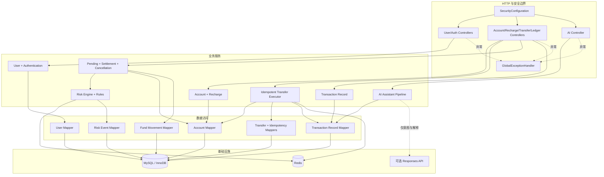
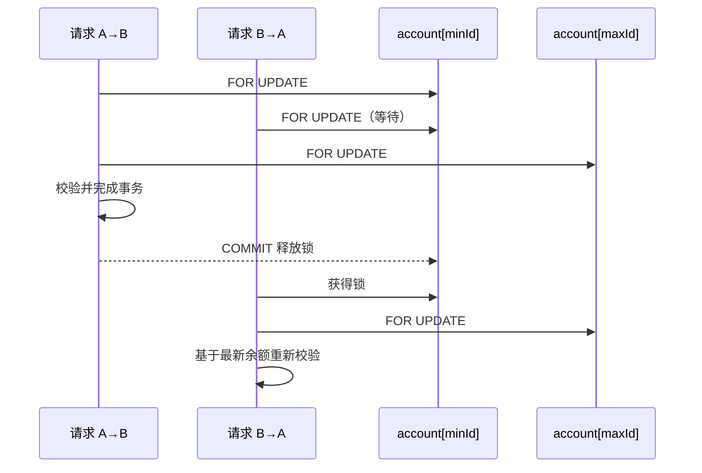
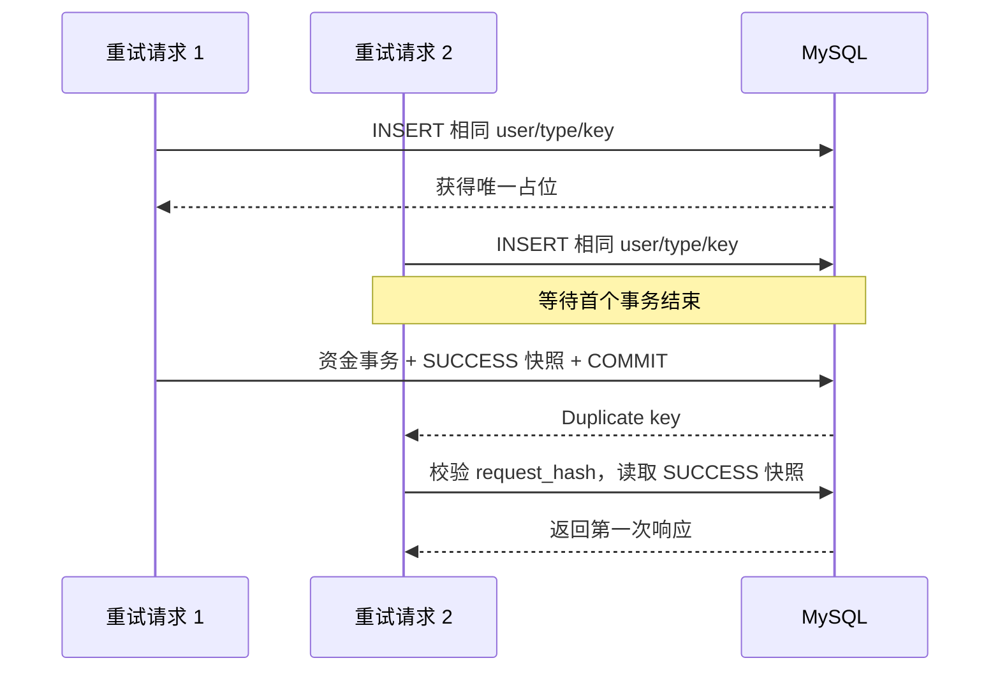
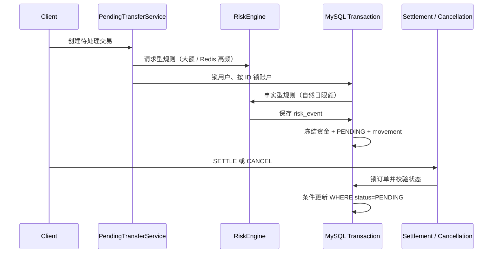
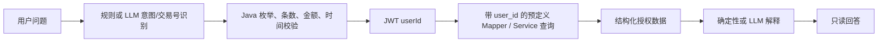
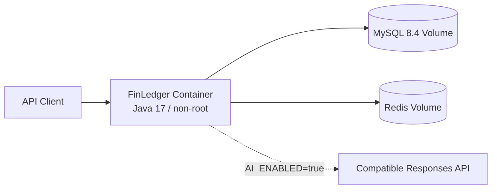

# FinLedger 架构与核心时序

## 架构目标

FinLedger 采用模块化单体：一个部署单元、一个 MySQL 事务边界，但代码按业务能力划分。
这让账户扣款、入账、订单和流水可以使用本地事务保持原子性，也避免在学习核心一致性前
引入分布式事务和消息最终一致性。

核心约束：

- MySQL 是余额、订单、流水和幂等结果的唯一事实源；
- 已验证 JWT 的 `sub` 是用户身份来源；
- Controller 只做协议转换与校验，业务规则放在 Service；
- Mapper 只执行受控 SQL，不把数据库能力暴露给客户端或 LLM；
- Redis 和外部 AI 都是可选外围能力，不能决定资金结果。

## 组件关系



## 转账事务边界

`IdempotentTransferExecutor.execute` 是最外层数据库事务。其内部调用转账服务，默认使用
Spring 的 `REQUIRED` 传播，因此以下 SQL 属于同一个事务：

```text
INSERT 幂等占位
  -> 锁定两条账户记录
  -> 更新来源余额
  -> 更新目标余额
  -> 写转账订单
  -> 写来源 DEBIT 流水
  -> 写目标 CREDIT 流水
  -> 完成幂等占位并保存响应
  -> COMMIT
```

任一步抛出运行时异常，Spring 将整个事务回滚。测试通过故意让第二条流水插入失败，确认
余额、订单、流水和幂等占位均未残留，而不只是验证 Java 方法抛出了异常。

## 并发与锁顺序



业务方向不决定加锁方向。所有转账都先锁较小账户 ID，再锁较大 ID，从而打破 A→B 和
B→A 各持一把锁再等待对方的典型循环等待。锁只能在事务中发挥作用，并持有到提交或回滚。

项目主路径选择悲观锁；`AccountMapper.updateBalanceWithVersion` 还保留乐观锁 SQL 作为
学习对照。乐观锁更新影响 0 行时必须重新加载、重新校验和有界重试，不能继续返回成功。

## 幂等并发时序



“先查询 key 是否存在，再执行转账”存在检查与插入之间的竞态。唯一约束才是并发仲裁者。
请求 SHA-256 摘要保证同一个 key 不能悄悄代表另一笔转账。

## 余额与流水不变量

一次成功转账产生：

- 来源账户可用余额和总资金减少 `amount`，冻结余额不变；
- 目标账户可用余额和总资金增加同一 `amount`，冻结余额不变；
- 一条 `transfer_order`；
- 来源账户一条 `DEBIT` 流水；
- 目标账户一条 `CREDIT` 流水。

流水保存 `balance_before` 和 `balance_after`，在现有充值和最终转账流水中统一表示账户
`totalBalance` 快照。数据库检查约束要求借记满足 `after = before - amount`，贷记满足
`after = before + amount`。当前双余额负责快速读，流水负责解释“总资金为什么是这个数”以及
后续对账；冻结组成变化由 `fund_movement_record` 的 available/frozen/total 快照记录。

## 待处理交易与风控事务

待处理交易没有改变原有立即转账接口，而是在 `settlement` 模块复用账户锁、订单和双边流水。
创建 PENDING 时可用额转为冻结额，总额不变；SETTLED 时来源冻结额最终扣减、目标可用额增加；
CANCELLED 时冻结额回到来源可用额。



SETTLE 与 CANCEL 对同一订单竞争行锁。获胜事务提交终态后，另一个事务看到最新状态并失败；
条件 UPDATE 再防止陈旧状态覆盖。详细不变量见 [settlement.md](settlement.md)，风险阶段取舍见
[risk-control.md](risk-control.md)。

## AI 安全边界



交易状态解释先提取 `transactionNo`，Java 再按 JWT userId 查询本人 DEFERRED 订单及
`risk_event`；知道其他人的交易号也只会得到 not found。LLM 不接收 JDBC 连接，不生成可执行 SQL，也没有充值、冻结、清算或转账工具。即使模型输出越界参数，
Java 仍会把意图限制在固定枚举、最多 10 条和合法金额范围；最终数据查询始终绑定 JWT 用户。

## 部署视图



Compose 的 `app` 使用 profile 管理，MySQL 和 Redis 可以独立作为本地开发基础设施运行。
CI 在 Java 17 上执行全部测试并构建同一个 Dockerfile。
