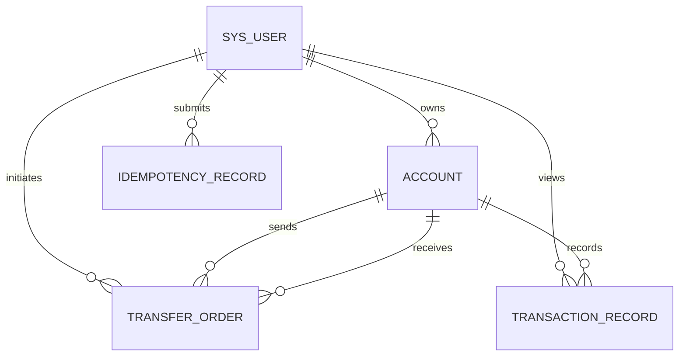

# FinLedger database design (Phase 3)

## Scope

The first schema contains only five core tables. MySQL is the source of truth for
account balances; Redis must never replace these records.



## Table responsibilities

| Table | Responsibility |
| --- | --- |
| `sys_user` | Login identity, password hash, and user state |
| `account` | Current account balance, state, and optimistic-lock version |
| `transfer_order` | One business order for each accepted transfer |
| `transaction_record` | Immutable debit/credit history for balance changes |
| `idempotency_record` | Unique ownership and result of an idempotent request |

## Core decisions

- Money uses `DECIMAL(19,2)` in MySQL and will use `BigDecimal` in Java.
- The initial product supports CNY only. A schema migration is required before
  adding another currency.
- Every table uses InnoDB for transactions, row locks, and foreign keys.
- Database timestamps are generated in UTC and stored with millisecond precision.
- Account balance is optimized for current-state reads; transaction records are
  retained for audit, history, and reconciliation.
- One successful transfer creates one `transfer_order` plus two
  `transaction_record` rows: source `DEBIT` and destination `CREDIT`.
- Financial tables do not use cascading deletes. Referenced users and accounts
  cannot be physically removed while financial records exist.
- Idempotency keys are case-sensitive opaque ASCII values. Their unique scope is
  `(user_id, business_type, idempotency_key)`.
- `request_hash` detects reuse of the same idempotency key with different request
  content.

## Constraints versus Java validation

Database constraints are the final safety net, not a replacement for service-layer
validation. Java will still provide readable business errors before an invalid SQL
statement is attempted.

Examples enforced by the database:

- Account and recorded balances cannot be negative.
- Transfer and transaction amounts must be positive.
- Source and destination accounts must differ.
- A debit/credit record must reconcile its before and after balances.
- Account numbers, transfer numbers, and record numbers are unique.
- A user cannot claim the same idempotency key twice for the same business type.

Ownership rules such as "the initiator owns the source account" span multiple rows
and remain the responsibility of the Java transaction service.

## Schema application

Apply the versioned schema to an empty `finledger` database:

```bash
docker compose exec -T mysql sh -c \
  'MYSQL_PWD="$MYSQL_PASSWORD" mysql -u"$MYSQL_USER" "$MYSQL_DATABASE"' \
  < database/schema/V1__create_core_tables.sql
```

The file is deliberately versioned and contains no `DROP TABLE` or
`CREATE TABLE IF NOT EXISTS`. Re-running a migration silently can hide schema drift.
A migration tool can take ownership of later schema versions during engineering
hardening.
