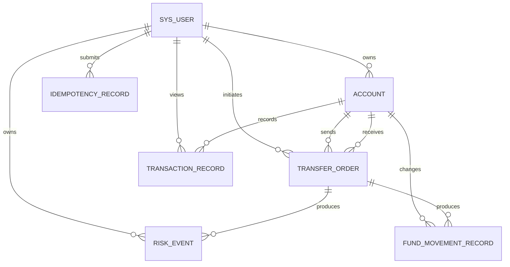

# FinLedger 数据库设计与演进

## 设计范围

MySQL 是账户余额、订单、流水、幂等结果和风险事件的 Source of Truth。V1 从五张核心表
起步；V2 用增量 DDL 加入双余额模型、资金变动记录和风险事件，没有改写已使用的 V1。



## 表职责

| 表 | 职责 |
| --- | --- |
| `sys_user` | 登录身份、密码摘要和用户状态 |
| `account` | 总额、可用额、冻结额、账户状态与乐观锁版本 |
| `transfer_order` | 立即/待处理交易订单、状态和总风控结论 |
| `transaction_record` | 充值和最终转账的不可变借贷流水 |
| `idempotency_record` | 幂等请求的唯一执行权、摘要和成功快照 |
| `fund_movement_record` | FREEZE / SETTLEMENT / UNFREEZE 的三类余额快照 |
| `risk_event` | 每条命中风控规则的等级、结论和原因 |

## 双余额不变量

为兼容原有接口，V2 保留 `account.balance` 作为总额，并增加：

```text
balance = available_balance + frozen_balance
available_balance >= 0
frozen_balance >= 0
```

三条约束同时由 Java 业务校验和 MySQL `CHECK` 保护。老数据迁移时先把原 `balance` 回填到
`available_balance`，冻结余额为零，因此迁移前后总资金不变。

| 动作 | 总额变化 | 可用额变化 | 冻结额变化 |
| --- | ---: | ---: | ---: |
| 充值 | `+amount` | `+amount` | 0 |
| 立即转出 | `-amount` | `-amount` | 0 |
| 创建 PENDING | 0 | `-amount` | `+amount` |
| SETTLEMENT（来源） | `-amount` | 0 | `-amount` |
| SETTLEMENT（目标） | `+amount` | `+amount` | 0 |
| CANCELLATION | 0 | `+amount` | `-amount` |

`fund_movement_record` 保存冻结相关操作的 available/frozen/total 前后值，唯一键
`(business_type, business_id, account_id, action)` 防止同一动作重复记账。最终清算仍写入
来源 DEBIT、目标 CREDIT 两条 `transaction_record`。

## 关键约束

- 金额统一为 MySQL `DECIMAL(19,2)` 和 Java `BigDecimal`；
- InnoDB 提供本地事务、外键与行锁；
- 账户号、转账号、流水号和资金变动号唯一；
- 转账金额为正、来源目标不能相同；
- 借贷流水的 before/after 必须与 direction 和 amount 对账；
- 风险事件按 `(business_no, rule_code)` 去重；
- 幂等键按 `(user_id, business_type, idempotency_key)` 唯一，请求摘要阻止 key 参数复用；
- 金融记录无级联删除，避免删除身份或账户时连带抹去审计事实。

数据库约束是最后防线，不替代 Service 的可读业务异常。账户归属、合法状态流转和风控策略
需要跨行判断，仍由 Java 事务服务控制。

## 迁移应用

新数据库由 Compose 初始化目录按文件名顺序执行 V1、V2。已有 V1 数据库需要只执行 V2：

```bash
docker compose exec -T mysql sh -c \
  'MYSQL_PWD="$MYSQL_PASSWORD" mysql -u"$MYSQL_USER" "$MYSQL_DATABASE"' \
  < database/schema/V2__add_settlement_and_risk.sql
```

迁移文件刻意不使用 `DROP` 或 `IF NOT EXISTS`，重复执行会显式失败，从而暴露环境漂移。
执行前应备份并检查 `account.available_balance` 是否已经存在。后续可引入 Flyway 自动记录
迁移版本，但不能回写 V1 假装结构从未演进。
