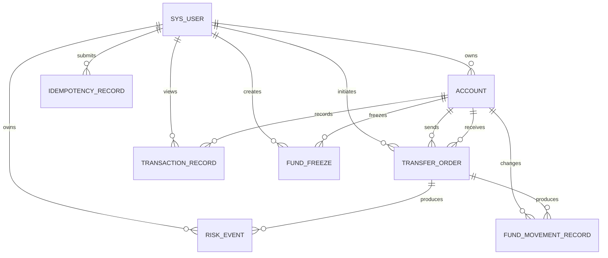

# FinLedger 数据库设计与演进

## 设计范围

MySQL 是账户余额、订单、流水、幂等结果和风险事件的 Source of Truth。V1 从五张核心表
起步；V2 用增量 DDL 加入双余额模型、资金变动记录和风险事件；V3 在确认数据完成回填后
移除过渡期的冗余 `balance` 列；V4 增加独立资金冻结业务记录并扩展既有幂等/资金变化类型。
已经执行过的迁移从不回写。



## 表职责

| 表 | 职责 |
| --- | --- |
| `sys_user` | 登录身份、密码摘要和用户状态 |
| `account` | 可用额、冻结额、账户状态与乐观锁版本；总资金由双余额计算 |
| `transfer_order` | 立即/待处理交易订单、状态和总风控结论 |
| `transaction_record` | 充值和最终转账的不可变借贷流水 |
| `idempotency_record` | 幂等请求的唯一执行权、摘要和成功快照 |
| `fund_freeze` | 独立资金冻结业务事实、外部冻结号和当前 FROZEN 状态 |
| `fund_movement_record` | FREEZE / SETTLEMENT / UNFREEZE 的三类余额快照 |
| `risk_event` | 每条命中风控规则的等级、结论和原因 |

## Account Balance Model

当前数据库只保存两个权威金额字段：

- `available_balance`：当前可以直接参加普通转账等资金操作的金额；
- `frozen_balance`：已被待处理交易预留、不能再次消费的金额。

总资金是派生概念，不建立第三个冗余列：

```text
totalBalance = available_balance + frozen_balance
available_balance >= 0
frozen_balance >= 0
```

`available_balance` 和 `frozen_balance` 的非负约束、两者之和不超过 `DECIMAL(19,2)` 范围的
约束同时由 Java 业务校验和 MySQL `CHECK` 保护。API 的 `totalBalance` 由 Response DTO 计算，
因此不会出现三个金额列需要同步更新的问题。

只有一个余额无法区分“用户拥有”与“当前可花”：已经为待处理交易预留的资金仍属于用户，
但不能被另一笔交易重复消费。冻结和解冻只在 available/frozen 之间移动金额，不改变总资金；
充值、立即转账或最终结算才会改变相关账户的总资金。

| 动作 | 总额变化 | 可用额变化 | 冻结额变化 |
| --- | ---: | ---: | ---: |
| 充值 | `+amount` | `+amount` | 0 |
| 立即转出 | `-amount` | `-amount` | 0 |
| 创建 PENDING | 0 | `-amount` | `+amount` |
| 独立 FREEZE | 0 | `-amount` | `+amount` |
| SETTLEMENT（来源） | `-amount` | 0 | `-amount` |
| SETTLEMENT（目标） | `+amount` | `+amount` | 0 |
| CANCELLATION | 0 | `+amount` | `-amount` |

`fund_movement_record` 保存冻结相关操作的 available/frozen/total 前后值，唯一键
`(business_type, business_id, account_id, action)` 防止同一动作重复记账。最终清算仍写入
来源 DEBIT、目标 CREDIT 两条 `transaction_record`。

## 关键约束

- 金额统一为 MySQL `DECIMAL(19,2)` 和 Java `BigDecimal`；
- InnoDB 提供本地事务、外键与行锁；
- 账户号、转账号、流水号和资金变动号唯一；
- 独立冻结号唯一，冻结金额为正，用户和账户由外键约束；
- 转账金额为正、来源目标不能相同；
- 借贷流水的 before/after 必须与 direction 和 amount 对账；
- 风险事件按 `(business_no, rule_code)` 去重；
- 幂等键按 `(user_id, business_type, idempotency_key)` 唯一，请求摘要阻止 key 参数复用；
- 金融记录无级联删除，避免删除身份或账户时连带抹去审计事实。

数据库约束是最后防线，不替代 Service 的可读业务异常。账户归属、合法状态流转和风控策略
需要跨行判断，仍由 Java 事务服务控制。

## 迁移应用

新数据库由 Compose 初始化目录按文件名顺序执行 V1、V2、V3、V4。

迁移采用“新增、回填、收敛”而不是直接改写 V1：

1. V2 新增 `available_balance` 和 `frozen_balance`；
2. V2 将每个旧账户的 `balance = X` 回填为 `available_balance = X`、`frozen_balance = 0`；
3. V2 用约束验证过渡期 `balance = available_balance + frozen_balance`；
4. V3 移除依赖旧列的约束和 `balance` 列，最终只保留双余额。
5. V4 创建 `fund_freeze`，并允许幂等和资金变化记录使用 `FUND_FREEZE` 业务类型。

因此迁移前后的资金恒等式为
`old balance = new available_balance + new frozen_balance`，旧资金不会丢失。

已有 V1 数据库依次执行 V2、V3、V4：

```bash
docker compose exec -T mysql sh -c \
  'MYSQL_PWD="$MYSQL_PASSWORD" mysql -u"$MYSQL_USER" "$MYSQL_DATABASE"' \
  < database/schema/V2__add_settlement_and_risk.sql

docker compose exec -T mysql sh -c \
  'MYSQL_PWD="$MYSQL_PASSWORD" mysql -u"$MYSQL_USER" "$MYSQL_DATABASE"' \
  < database/schema/V3__remove_redundant_account_balance.sql

docker compose exec -T mysql sh -c \
  'MYSQL_PWD="$MYSQL_PASSWORD" mysql -u"$MYSQL_USER" "$MYSQL_DATABASE"' \
  < database/schema/V4__add_fund_freeze.sql
```

已经执行 V3 的数据库只执行 V4。迁移文件刻意不使用 `IF NOT EXISTS`，重复执行会显式失败，
从而暴露环境漂移。执行前应备份，并通过 `information_schema.columns` 确认当前版本：V1 只有
`balance`，V2 三列共存，V3 只有 `available_balance` / `frozen_balance`，V4 还存在
`fund_freeze` 表。后续可引入 Flyway
自动记录迁移版本，但不能回写 V1 假装结构从未演进。
