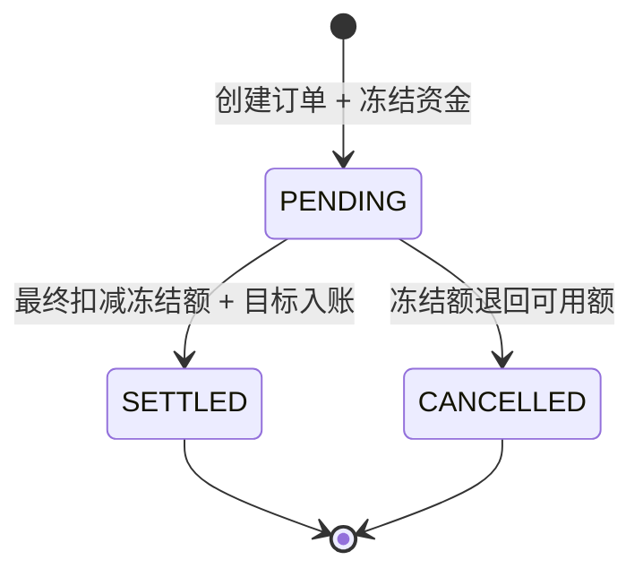

# 资金冻结、清算与交易状态机

## 为什么区分可用和冻结

总余额回答“用户一共还有多少资金”，可用余额回答“现在还能使用多少”，冻结余额表示已被一笔
待处理交易预留、但尚未最终扣减的资金。三者满足：

```text
totalBalance = availableBalance + frozenBalance
```

如果创建待处理交易时直接永久扣款，后续审核失败或用户撤销时就缺少明确的预留阶段；如果只写
订单而不冻结，并发交易又可能重复使用同一笔可用资金。

## 生命周期



`DeferredTransferStateMachine` 集中定义唯一合法流转。Controller 只能调用创建、清算、撤销
Service，不能直接接收或更新任意 status。

## 创建 PENDING

`PendingTransferService` 先做不需要数据库锁的大额/高频预检查，再调用带 `@Transactional` 的
`PendingTransferExecutor`：

1. 锁定当前用户行，使同一用户跨账户的自然日限额计算串行；
2. 按账户 ID 升序 `SELECT ... FOR UPDATE` 锁定双方账户；
3. 校验来源归属、账户状态、币种和可用余额；
4. 写入 `PROCESSING` 的 DEFERRED 订单；
5. 在事务内执行依赖 MySQL 事实的 DAILY_LIMIT 并保存风险事件；
6. PASS/REVIEW 时将来源 `available -= amount`、`frozen += amount`；
7. 写 FREEZE 资金变动记录并把订单改成 PENDING；
8. REJECT 时保存 FAILED/REJECT 订单和风险事件，不冻结资金。

冻结的三项余额更新、订单和资金变动记录在同一个事务，任一步失败都会整体回滚。

## 清算与撤销

清算先锁订单，再按固定账户顺序锁双方账户：

```text
source: total -= amount, frozen -= amount
target: total += amount, available += amount
```

同一事务写 SETTLEMENT 资金变动、来源 DEBIT 和目标 CREDIT 流水，并把 PENDING 改成
SETTLED。

撤销先锁订单和来源账户：

```text
source: total 不变, available += amount, frozen -= amount
```

随后写 UNFREEZE 资金变动并把订单改成 CANCELLED。终态再次执行会得到
`INVALID_TRANSACTION_STATE`，不会重复扣款或解冻。

## SETTLE 与 CANCEL 并发

两个事务都先对同一 `transfer_order` 执行 `SELECT ... FOR UPDATE`。第一个获得行锁并提交后，
第二个读到的已是最新终态，状态机立即拒绝。最终更新还使用：

```sql
UPDATE transfer_order
SET status = ?
WHERE id = ? AND status = 'PENDING';
```

这条条件更新是最后一道 compare-and-set 防线：只有观察到 PENDING 的执行者能影响一行。
如果影响行数不是 1，事务抛异常并回滚自己的资金操作。Testcontainers 用两个真实线程同时
清算和撤销，断言恰好一个成功、冻结额归零且双方总资金守恒。

## 锁顺序与事务边界

订单生命周期操作统一先锁订单再锁账户；涉及两账户时仍按较小 ID、较大 ID 加锁。这降低循环
等待风险，但不等同于生产环境绝无死锁。生产增强应识别数据库死锁，在幂等保护下对完整事务做
少量有界重试。
