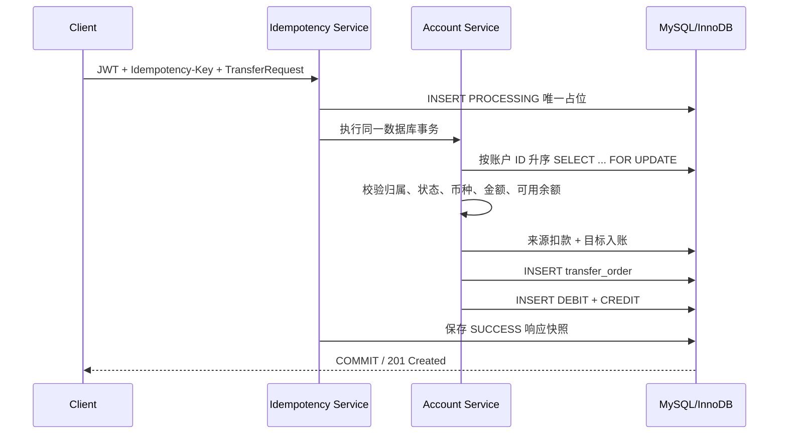

# FinLedger 完整交易流程

## 立即转账

`POST /api/transfers` 适合无需后续确认的模拟转账。客户端必须携带 JWT 和
`Idempotency-Key`，一次成功请求按以下顺序执行：



幂等占位、两个账户更新、订单、两条流水和响应快照都在同一 `@Transactional` 边界内。
任何关键 SQL 抛出运行时异常都会让全部写入回滚。

## 待处理交易

`POST /api/transfers/pending` 用于需要冻结、清算或撤销的交易：

```text
Available
   │ Freeze：available -= amount，frozen += amount，总额不变
   ▼
Frozen / PENDING
   ├── Settlement：source.frozen -= amount，destination.available += amount
   └── Cancellation：source.frozen -= amount，source.available += amount
```

订单状态只允许：

```text
PENDING
├── SETTLED
└── CANCELLED
```

`SETTLED` 和 `CANCELLED` 都是终态。没有通用修改状态接口，状态变更必须经过集中状态机、
订单行锁和 `WHERE status = 'PENDING'` 条件更新。

## 创建 PENDING 的事务

1. 校验来源和目标不能相同，金额必须是正的两位小数；
2. 在事务前执行 Redis 高频规则；Redis 失败按显式 fail-open 策略继续；
3. 在事务内锁定用户行，序列化同一用户的自然日累计检查；
4. 按账户 ID 升序锁定来源和目标账户；
5. 创建 `PROCESSING` 订单，执行大额和 UTC 自然日累计规则；
6. 保存每条非 PASS 的 `risk_event`；
7. 若总决策为 REJECT，订单转为 `FAILED/REJECT`，不冻结资金；
8. 否则将来源 `available → frozen`，写 `FREEZE` movement，订单转为 `PENDING`；
9. 提交事务。

REJECT 事实必须提交后再由外层抛出业务异常，否则订单和风险审计也会被事务回滚。

## Settlement

清算先锁订单并确认本人、DEFERRED 类型和 PENDING 状态，再按固定顺序锁两个账户。
来源账户只扣 `frozenBalance`，不能再次扣 `availableBalance`；目标账户增加可用额。随后写来源
DEBIT、目标 CREDIT、来源 SETTLEMENT movement，最后条件更新订单为 SETTLED。任一步失败，
账户、流水、movement 和订单终态全部回滚，订单仍为 PENDING。

## Cancellation

撤销先锁订单，再锁来源账户，将同一金额从 frozen 原子退回 available，写 UNFREEZE movement，
最后条件更新为 CANCELLED。重复撤销、已清算后撤销或重复清算都由状态机拒绝，不会二次解冻或
二次入账。

## 余额与流水为什么都要保存

账户余额回答“现在有多少钱”，适合高频读取；订单与不可变流水回答“为什么变成这个数”，用于
历史、审计和对账。只存流水会让余额查询依赖长期聚合；只存余额无法解释历史变化。因此当前
余额、订单、交易流水和冻结 movement 必须在同一事务里保持一致。

## 验证证据

Testcontainers 集成测试使用真实 MySQL 8.4，验证正常清算/撤销、终态重复操作、清算流水故障
回滚、解冻 movement 故障回滚，以及 SETTLE 与 CANCEL 两线程竞争时恰好一个成功且总资金守恒。

